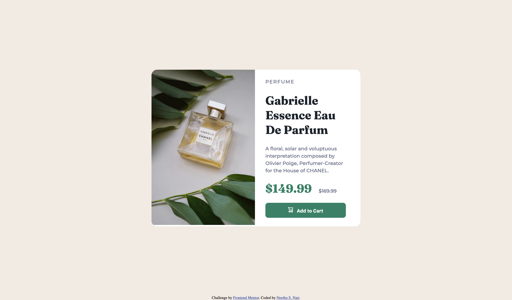

# Frontend Mentor - Product preview card component solution

This is a solution to the [Product preview card component challenge on Frontend Mentor](https://www.frontendmentor.io/challenges/product-preview-card-component-GO7UmttRfa). Frontend Mentor challenges help you improve your coding skills by building realistic projects. 

## Table of contents

- [Overview](#overview)
  - [The challenge](#the-challenge)
  - [Screenshot](#screenshot)
  - [Links](#links)
- [My process](#my-process)
  - [Built with](#built-with)
- [Author](#author)

**Note: Delete this note and update the table of contents based on what sections you keep.**

## Overview

### The challenge

Users should be able to:

- View the optimal layout depending on their device's screen size
- See hover and focus states for interactive elements

### Screenshot

#### Desktop Design

#### Mobile Design

### Links

- Solution URL: [nees101/FrontendMentor](https://www.frontendmentor.io/solutions/responsive-product-preview-card-with-html-and-css-LwYFy3ZYI8)
- Live Site URL: [nees101/github](https://nees101.github.io/product-preview-card-component/)

## My process

### Built with

- Semantic HTML5 markup
- CSS custom properties
- Flexbox

## Author

- Website - [Neethu S. Nair](https://www.neethunair.com)
- Frontend Mentor - [@nees101](https://www.frontendmentor.io/profile/nees101)
- Github - [@nees101](https://www.github.com/nees101)

